# 🎯 Sistema de Webhooks Melhorado

O sistema de webhooks foi completamente reformulado para garantir que eventos de mensagens WhatsApp sejam corretamente capturados e enviados para seus endpoints configurados.

## 🔧 O que foi corrigido

### ❌ Problema anterior
- Webhooks não eram acionados quando mensagens reais eram recebidas
- Apenas o teste manual funcionava
- Faltava um backend para receber webhooks do Evolution API

### ✅ Solução implementada
- **Servidor de webhooks dedicado** na porta 3001
- **Captura de eventos reais** do Evolution API
- **Disparo automático** dos webhooks configurados
- **Logs e monitoramento** completos

## 🚀 Arquitetura

```mermaid
graph TD
    A[Evolution API] -->|Webhook| B[Servidor Webhooks :3001]
    B --> C[Buscar Webhooks Ativos]
    C --> D[Disparar Webhooks Usuário]
    D --> E[Registrar Entregas]
    
    F[Frontend] -->|Mensagem via WebSocket| G[Hook useRealTimeConnection]
    G --> H[Disparar Webhooks]
    H --> C
```



## 📋 Configuração

### 1. Instalar dependências
```bash
npm install
```

### 2. Configurar variáveis de ambiente
Adicione no seu arquivo `.env`:

```env
# Servidor de Webhooks
WEBHOOK_PORT=3001
WEBHOOK_BASE_URL=http://localhost:3001
FRONTEND_URL=http://localhost:5173
```

### 3. Iniciar servidor de webhooks
```bash
# Produção
npm run webhook-server

# Desenvolvimento (com auto-reload)
npm run webhook-server:dev
```

### 4. Configurar webhook no Evolution API
O sistema configurará automaticamente o webhook quando você conectar uma instância WhatsApp.

## 🎯 Como usar

### 1. Criar um webhook
1. Acesse **Configurações → Webhooks**
2. Clique em **"Novo Webhook"**
3. Configure:
   - **Nome**: Nome descritivo
   - **URL**: Seu endpoint (ex: `https://seu-site.com/webhook`)
   - **Eventos**: Selecione "Mensagem WhatsApp"
   - **Status**: Ativo

### 2. Testar webhook
```bash
# Teste rápido dos webhooks
npm run debug-webhooks
```

### 3. Monitorar entregas
- Acesse **Configurações → Webhooks**
- Veja estatísticas e logs de entrega
- Monitore sucessos e falhas

## 📨 Formato do payload

Quando uma mensagem WhatsApp é recebida, seu webhook receberá:

```json
{
  "event": "whatsapp_message",
  "timestamp": "2024-01-01T12:00:00.000Z",
  "data": {
    "instanceName": "minha-instancia",
    "messageId": "MESSAGE_ID",
    "from": "5511999999999@s.whatsapp.net",
    "to": "minha-instancia",
    "message": "Texto da mensagem",
    "timestamp": "2024-01-01T12:00:00.000Z",
    "type": "text",
    "isGroup": false,
    "pushName": "Nome do Contato",
    "originalData": { ... }
  }
}
```

## 🔒 Segurança

### Headers automáticos
- `Content-Type: application/json`
- `User-Agent: ElevROI-Webhook/1.0`
- `X-Webhook-Signature` (se secret_key configurada)

### Assinatura HMAC
Configure uma `secret_key` no webhook para validar a autenticidade:

```javascript
// Validar assinatura no seu endpoint
const crypto = require('crypto')

function validateSignature(payload, signature, secret) {
  const expectedSignature = crypto
    .createHmac('sha256', secret)
    .update(payload)
    .digest('hex')
  
  return signature === expectedSignature
}
```

## 🔧 Troubleshooting

### Webhook não dispara

1. **Verificar servidor de webhooks**:
```bash
curl http://localhost:3001/api/health
```

2. **Verificar webhook configurado**:
```bash
npm run debug-webhooks
```

3. **Logs do servidor**:
```bash
npm run webhook-server:dev
```

### Webhook retorna erro

1. **Verificar URL**: Deve responder em 30 segundos
2. **Verificar formato**: Retornar status HTTP 200-299
3. **Verificar logs**: Acessar histórico de entregas

### Evolution API não envia webhooks

1. **Verificar configuração**:
```javascript
// No console do navegador
const baseUrl = 'http://localhost:3001'
const instance = 'sua-instancia'
await evolutionAPI.configureRealTimeWebhook(instance, baseUrl)
```

2. **Verificar conectividade**:
```bash
# Do servidor Evolution API
curl http://localhost:3001/api/webhooks/test/sua-instancia
```

## 📊 Monitoramento

### Logs em tempo real
```bash
# Ver logs do servidor de webhooks
npm run webhook-server:dev

# Ver logs de debug
npm run debug-webhooks
```

### Métricas no banco
- Total de entregas
- Taxa de sucesso
- Tempo de resposta
- Últimos erros

### Endpoints de monitoramento
- `GET /api/health` - Status do servidor
- `GET /api/webhooks/test/:instance` - Teste de conectividade

## 🚀 Deployment

### Docker Compose
Adicione ao seu `docker-compose.yml`:

```yaml
  webhook-server:
    build: .
    command: npm run webhook-server
    ports:
      - "3001:3001"
    environment:
      - WEBHOOK_PORT=3001
      - FRONTEND_URL=http://frontend:5173
    depends_on:
      - supabase
```

### Nginx proxy
```nginx
location /api/webhooks/ {
    proxy_pass http://webhook-server:3001;
    proxy_set_header Host $host;
    proxy_set_header X-Real-IP $remote_addr;
}
```

### Variáveis de produção
```env
WEBHOOK_PORT=3001
WEBHOOK_BASE_URL=https://seu-dominio.com
FRONTEND_URL=https://seu-dominio.com
```

## 🎯 Exemplo prático

### 1. Criar webhook para notificações
```javascript
// Seu endpoint em https://seu-site.com/webhook
app.post('/webhook', (req, res) => {
  const { event, data } = req.body
  
  if (event === 'whatsapp_message') {
    console.log(`Nova mensagem de ${data.pushName}: ${data.message}`)
    
    // Enviar para Discord, Slack, etc.
    notifyTeam(data)
  }
  
  res.json({ success: true })
})
```

### 2. Integrar com CRM
```javascript
app.post('/webhook', async (req, res) => {
  const { event, data } = req.body
  
  if (event === 'whatsapp_message') {
    // Criar/atualizar contato no CRM
    await crm.updateContact({
      phone: data.from.replace('@s.whatsapp.net', ''),
      name: data.pushName,
      lastMessage: data.message,
      lastContact: data.timestamp
    })
  }
  
  res.json({ success: true })
})
```

## 🔄 Migração

Se você já tinha webhooks configurados:

1. **Atualizar URLs**: Mudar de frontend para servidor dedicado
2. **Reconfigurar Evolution API**: Executar `npm run debug-webhooks`
3. **Testar fluxo**: Enviar mensagem de teste

## 📞 Suporte

- **Logs de debug**: `npm run debug-webhooks`
- **Teste manual**: Botão "Testar Webhook" na interface
- **Monitoramento**: Acessar histórico de entregas

---

🎉 **Agora seus webhooks funcionam perfeitamente com mensagens reais do WhatsApp!** 