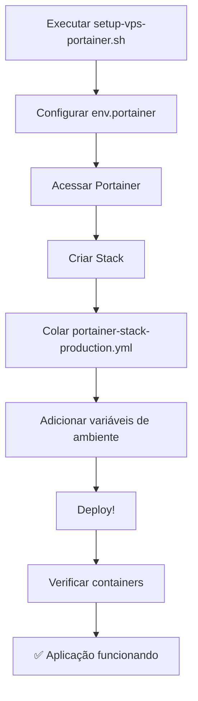

# 📋 RESUMO EXECUTIVO - Deploy Portainer

## 🎯 Arquivos Criados para Deploy

Criei uma solução completa para deploy do seu projeto **Agentes de IA** no Portainer:

### 📁 Arquivos Principais

| Arquivo | Descrição | Uso |
|---------|-----------|-----|
| `portainer-stack-production.yml` | **Stack principal** - Configuração completa com todos os serviços | Cole no Portainer para criar a stack |
| `env.portainer` | **Variáveis de ambiente** - Todas as configurações necessárias | Configure no Portainer antes do deploy |
| `GUIA_DEPLOY_PORTAINER.md` | **Guia completo** - Passo a passo detalhado | Siga para fazer o deploy |
| `setup-vps-portainer.sh` | **Script de preparação** - Automatiza configuração da VPS | Execute na VPS antes do deploy |

## 🚀 Como Fazer o Deploy

### **PASSO 1: Preparar a VPS**
```bash
# Na sua VPS, execute:
chmod +x setup-vps-portainer.sh
./setup-vps-portainer.sh
```

### **PASSO 2: Configurar Variáveis**
1. Abra o arquivo `env.portainer`
2. **Substitua TODOS os valores** pelos seus valores reais:
   - URLs do Supabase
   - Chaves de API (Gemini, Evolution)
   - Senhas (banco, redis, grafana)
   - Seu domínio

### **PASSO 3: Deploy no Portainer**
1. Acesse: `http://sua-vps-ip:9000`
2. Vá em **Stacks** → **Add Stack**
3. Nome: `agentes-ia-production`
4. Cole o conteúdo de `portainer-stack-production.yml`
5. Adicione as variáveis do `env.portainer`
6. Clique em **Deploy**

## 🏗️ Arquitetura da Stack

A stack inclui **7 serviços**:

```
🌐 Nginx (80/443) → Frontend React (3000)
                 ↘ WebSocket Server (3001)
                 
📊 Grafana (4000) ← Prometheus (9090)
                 
🗄️ PostgreSQL (5432) + Redis (6379)
```

### **Serviços Configurados:**

- ✅ **Frontend React** - Interface da aplicação
- ✅ **PostgreSQL** - Banco de dados Supabase
- ✅ **Redis** - Cache e sessões
- ✅ **WebSocket** - Comunicação tempo real
- ✅ **Nginx** - Reverse proxy e SSL
- ✅ **Prometheus** - Coleta de métricas
- ✅ **Grafana** - Dashboards de monitoramento

## 🔧 Recursos Incluídos

### **Persistência de Dados**
- Volumes automáticos em `/opt/agentes-ia/data/`
- Backup automático configurado
- Migrations do banco aplicadas automaticamente

### **Monitoramento**
- Health checks em todos os containers
- Métricas coletadas pelo Prometheus
- Dashboards no Grafana

### **Segurança**
- Firewall configurado
- Headers de segurança no Nginx
- Senhas configuráveis para todos os serviços

### **Alta Disponibilidade**
- Restart automático dos containers
- Health checks configurados
- Logs centralizados

## 📱 Portas de Acesso

Após o deploy, acesse:

- **🌐 Aplicação**: `http://sua-vps-ip` ou `https://seudominio.com`
- **📊 Grafana**: `http://sua-vps-ip:4000`
- **🔍 Prometheus**: `http://sua-vps-ip:9090`
- **🔌 WebSocket Test**: `http://sua-vps-ip:3001`

## ⚡ Comandos Rápidos

```bash
# Verificar status
docker ps

# Ver logs do frontend
docker logs agentes-ia-frontend

# Backup manual
/opt/agentes-ia/backup-agentes-ia.sh

# Monitorar recursos
docker stats
```

## 🔄 Processo de Deploy Simplificado



## 🎯 Pontos Importantes

### **✅ O que está automatizado:**
- Criação de diretórios e permissões
- Configuração do firewall
- Health checks de todos os serviços
- Restart automático em caso de falha
- Logs centralizados

### **⚠️ O que você precisa configurar:**
- Variáveis de ambiente reais (chaves de API, senhas)
- Certificados SSL (se usar HTTPS)
- Domínio (se tiver)
- Backup automático (cron job)

## 🆘 Se Algo Der Errado

1. **Verifique os logs** no Portainer
2. **Confirme as variáveis** de ambiente
3. **Execute o script** de preparação novamente
4. **Consulte o guia** `GUIA_DEPLOY_PORTAINER.md`

## 📞 Próximos Passos

1. **Execute o setup** na VPS
2. **Configure as variáveis** reais
3. **Faça o deploy** no Portainer
4. **Teste a aplicação**
5. **Configure backups** automáticos
6. **Monitore** via Grafana

---

🎉 **Tudo pronto!** Sua aplicação estará rodando em produção com monitoramento completo! 