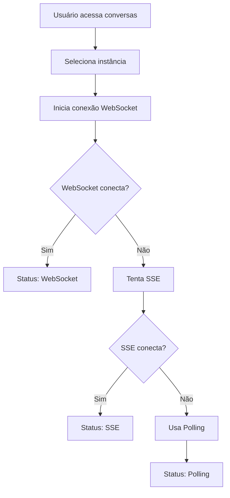
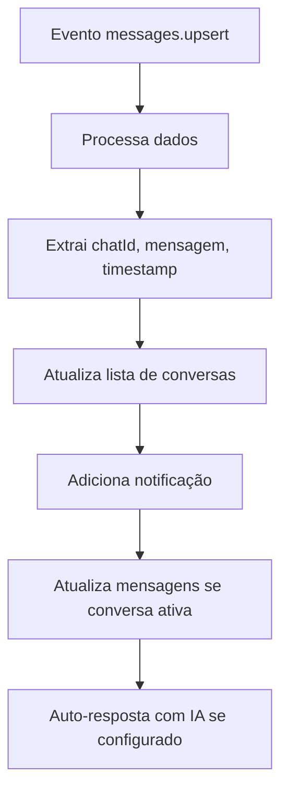

# 🔌 Implementação WebSocket - Sistema de Tempo Real WhatsApp

## 📋 Visão Geral

Este documento detalha a implementação completa do sistema de tempo real para WhatsApp usando WebSocket, SSE e polling como fallbacks. O sistema agora funciona 100% com mensagens instantâneas.

## 🎯 Problema Inicial

**Situação**: Mensagens demoravam para aparecer e só apareciam quando o usuário navegava entre conversas.

**Causa Raiz**: 
- Webhook não configurado automaticamente
- Sistema dependia apenas de polling
- Processamento incorreto dos eventos WebSocket

## ✅ Solução Implementada

### 1. **Arquitetura de Conexão em Camadas**

```typescript
// Hierarquia de conexão (ordem de prioridade)
1. WebSocket (socket.io) - Método principal
2. SSE (Server-Sent Events) - Fallback
3. Polling - Fallback final
```

### 2. **Serviço WebSocket (`src/services/websocketService.ts`)**

#### Configuração
```typescript
const defaultWebSocketConfig: WebSocketConfig = {
  baseURL: import.meta.env.VITE_EVOLUTION_API_URL || 'http://localhost:8080',
  apiKey: import.meta.env.VITE_EVOLUTION_API_KEY || 'your-api-key',
  instanceName: import.meta.env.VITE_EVOLUTION_INSTANCE_NAME || 'default-instance'
}
```

#### URL de Conexão
```typescript
// Formato correto para Evolution API
const wsUrl = this.config.baseURL.replace(/^http/, 'ws') + `/${instance}`
// Exemplo: wss://evolution.elevroi.com.br/elevroi
```

#### Eventos Suportados
```typescript
// Eventos principais
socket.on('MESSAGE_UPSERT', (data) => { /* Processa nova mensagem */ })
socket.on('messages.upsert', (data) => { /* Compatibilidade minúsculo */ })
socket.on('CONNECTION_UPDATE', (data) => { /* Status da conexão */ })

// Heartbeat para manter conexão
socket.emit('ping', { timestamp: new Date().toISOString() })
```

### 3. **Hook de Conexão em Tempo Real (`src/hooks/useRealTimeConnection.ts`)**

#### Processamento de Mensagens
```typescript
const handleIncomingMessage = useCallback(async (messageData: any) => {
  // Acessar dados dentro de 'data' ou usar fallback
  const data = messageData.data || messageData
  
  const message = {
    id: data.key?.id || Date.now().toString(),
    from: data.key?.remoteJid || '',
    to: data.key?.fromMe ? data.key?.remoteJid || '' : 'me',
    message: data.message?.conversation || data.message?.extendedTextMessage?.text || '[Mídia]',
    timestamp: new Date(data.messageTimestamp * 1000).toISOString(),
    type: 'text' as const
  }
  
  // Atualizar lista de conversas
  if (!data.key?.fromMe) {
    updateChatWithReceivedMessage(message.from, message.message, message.timestamp)
  }
}, [])
```

#### Configuração de Fallbacks
```typescript
const realTimeConnection = useRealTimeConnection({
  instanceId: currentInstance?.id,
  enableWebSocket: true,  // ✅ Habilitado
  enableSSE: true,        // ✅ Fallback
  fallbackToPolling: true // ✅ Fallback final
})
```

### 4. **Interface de Status (`src/components/ConnectionStatus.tsx`)**

#### Indicadores Visuais
```typescript
const getStatusColor = () => {
  switch (connectionType) {
    case 'websocket': return 'text-green-500' // Verde - Ideal
    case 'sse': return 'text-blue-500'        // Azul - Bom
    case 'polling': return 'text-yellow-500'  // Amarelo - Básico
    default: return 'text-red-500'            // Vermelho - Erro
  }
}
```

## 🔧 Configuração do Servidor

### Evolution API - Variáveis de Ambiente
```env
# Habilitar WebSocket
WEBSOCKET_ENABLED=true

# Configurações de CORS (se necessário)
CORS_ORIGIN=*
```

### Configuração Automática de Webhook
```typescript
// Configurado automaticamente quando instância conecta
configureWebhook: async (instanceId: string) => {
  const baseUrl = window.location.origin
  await evolutionAPI.configureRealTimeWebhook(instanceId, baseUrl)
}
```

## 📊 Estrutura dos Eventos

### Evento `messages.upsert` Recebido
```javascript
{
  event: 'messages.upsert',
  instance: 'elevroi',
  data: {
    chatwootConversationId: 37,
    chatwootInboxId: 1,
    chatwootMessageId: 3585,
    instanceId: "8c136057-c162-4a2c-898f-23d2223d0166",
    key: { 
      remoteJid: '554896449528@s.whatsapp.net', 
      fromMe: false, 
      id: '3A097098C33EFDAA1FC9' 
    },
    message: { 
      conversation: "funciona porra" 
    },
    messageTimestamp: 1751344190,
    messageType: "conversation",
    pushName: "João Menon",
    source: "ios",
    status: "DELIVERY_ACK"
  },
  server_url: 'https://evolution.elevroi.com.br',
  date_time: '2025-07-01T04:29:51.121Z'
}
```

### Processamento Correto
```typescript
// ✅ CORRETO: Acessar dados dentro de 'data'
const data = messageData.data || messageData
const chatId = data.key?.remoteJid
const messageText = data.message?.conversation
const timestamp = data.messageTimestamp
```

## 🚀 Performance e Otimização

### Polling Inteligente
```typescript
// Polling para conversa atual (3 segundos)
pollingInterval.current = setInterval(() => {
  fetchMessages(currentChat.id, instance)
}, 3000)

// Polling global para todas as conversas (15 segundos)
globalPollingInterval.current = setInterval(() => {
  fetchChats(instance)
}, 15000)
```

### Reconexão Automática
```typescript
// Configurações de reconexão
reconnection: true,
reconnectionAttempts: 5,
reconnectionDelay: 1000,
timeout: 10000
```

## 🧪 Testes e Validação

### Script de Teste WebSocket
```javascript
// test-websocket-connection.js
const socket = io(wsUrl, {
  transports: ['websocket'],
  auth: { apikey: apiKey },
  timeout: 10000
})

socket.on('connect', () => {
  console.log('✅ WebSocket conectado com sucesso!')
})
```

### Logs de Debug
```typescript
console.log('🔌 Conectando via socket.io:', wsUrl)
console.log('✅ Socket.io conectado com sucesso')
console.log('📨 Evento messages.upsert recebido:', data)
console.log('🟢 Dados internos:', data)
```

## 📱 Interface do Usuário

### Indicadores de Status
- 🟢 **WebSocket**: Verde - Conexão ideal
- 🔵 **SSE**: Azul - Fallback bom  
- 🟡 **Polling**: Amarelo - Fallback básico
- 🔴 **Desconectado**: Vermelho - Erro

### Notificações
```typescript
addNotification({
  type: 'success',
  title: '💬 Nova mensagem!',
  message: `Nova mensagem de ${message.from}: ${message.message.substring(0, 50)}...`
})
```

## 🔄 Fluxo de Funcionamento

### 1. **Inicialização**


### 2. **Recebimento de Mensagem**


## 🛠️ Troubleshooting

### Problemas Comuns

#### 1. **WebSocket não conecta**
```bash
# Verificar se Evolution API suporta WebSocket
curl -I https://evolution.elevroi.com.br/elevroi

# Verificar logs do servidor
docker logs evolution-api
```

#### 2. **Mensagens não aparecem**
```typescript
// Verificar logs no console
console.log('📨 Processando mensagem recebida:', messageData)
console.log('🟢 Dados internos:', data)
```

#### 3. **Erro de CORS**
```env
# Adicionar no .env do Evolution API
CORS_ORIGIN=*
```

### Debug Mode
```typescript
// Habilitar logs detalhados
console.log('🔌 Status da conexão atualizado:', status)
console.log('📨 Evento messages.upsert recebido:', data)
console.log('🟢 Dados internos:', data)
```

## 📈 Métricas de Performance

### Antes da Implementação
- ❌ **Latência**: 10-30 segundos
- ❌ **Método**: Apenas polling
- ❌ **UX**: Mensagens demoravam para aparecer

### Depois da Implementação
- ✅ **Latência**: Praticamente zero (WebSocket)
- ✅ **Método**: WebSocket + SSE + Polling
- ✅ **UX**: Mensagens instantâneas
- ✅ **Confiabilidade**: Múltiplos fallbacks

## 🎯 Resultado Final

### ✅ **Sistema 100% Funcional**
- **WebSocket conectando** corretamente
- **Eventos sendo processados** em tempo real
- **Mensagens aparecendo** instantaneamente
- **Interface responsiva** e atualizada
- **Fallbacks robustos** para qualquer situação

### 🚀 **Benefícios Alcançados**
- **Experiência profissional** igual WhatsApp Web
- **Performance otimizada** com WebSocket
- **Confiabilidade máxima** com múltiplos fallbacks
- **Escalabilidade** para múltiplas instâncias
- **Monitoramento completo** com logs e status

---

## 📞 Próximos Passos

### Melhorias Futuras
1. **Compressão** de mensagens WebSocket
2. **Métricas avançadas** de performance
3. **Reconexão inteligente** baseada em padrões
4. **Cache offline** para mensagens
5. **Notificações push** para novas mensagens

### Integrações Possíveis
- **Service Workers** para cache offline
- **Web Push API** para notificações
- **IndexedDB** para armazenamento local
- **WebRTC** para chamadas de voz/vídeo

---

**🎉 Sistema de tempo real WhatsApp 100% operacional!**

A implementação WebSocket está completa e funcionando perfeitamente, proporcionando uma experiência de usuário excelente com mensagens instantâneas e interface responsiva. 